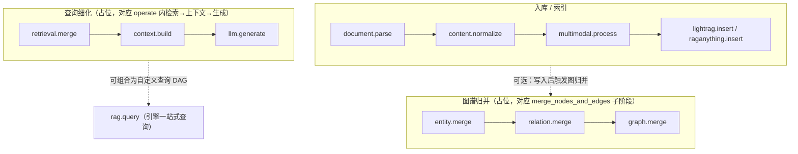

# 节点运行时架构说明

本文描述 `backend_runtime` 与现有 `adapters` 的关系，以及如何对接前端工作流编排与国产化部署。

## 0. 无 LightRAG 环境下加载 RAG-Anything 类型

``adapters/raganything/__init__.py`` 在导入时会加载引擎适配器，从而**需要** ``lightrag``。  
**节点运行时**通过 ``backend_runtime.core.raganything_isolated`` 仅执行 ``types.py`` / ``document_adapter.py`` 两个文件（桩注册 ``adapters.raganything`` 包），从而在**仅跑骨架、Mock 引擎**时不必安装 LightRAG。生产环境注入真实的 ``RAGAnythingEngineAdapter`` 时仍建议安装完整依赖并从 ``adapters`` 正式入口引用。

## 1. Adapter 与 Node 的区别

| 维度 | Adapter（`adapters/lightrag`、`adapters/raganything`） | Node（`backend_runtime/nodes`） |
|------|--------------------------------------------------------|----------------------------------|
| 定位 | 对 **具体引擎 SDK**（LightRAG / RAGAnything）的薄封装，稳定 API 边界 | 对 **业务步骤** 的可编排单元，对应画布上的一个方块 |
| 粒度 | 类级别，生命周期与应用进程绑定 | 实例级别，一次工作流 run 内按 DAG 多次 `run()` |
| 输入输出 | Python 类型化方法参数 / 返回值 | `NodeResult.data`（通常为 dict），在边上传递到下游 |
| 修改策略 | **本任务中禁止修改**，仅被引用 | 可独立演进，不污染上游包 |

Adapter 回答「怎么调引擎」；Node 回答「在工作流第几步、用什么配置调」。

## 2. Node 与 WorkflowRunner 的关系

- **WorkflowSchema**：静态图——`workflow_id`、`nodes`（每项含 `id`、`type`、`config`）、`edges`（有向边）、`entry_node_ids`。
- **WorkflowRunner**：按 **拓扑序** 逐个 `await node.run(...)`，无并行；上任一节点 `success=False` 或抛异常即停止。
- **ExecutionContext**：一次运行共享——`workflow_id`、`run_id`、`workspace`、`adapters`（由应用在启动时注入）、`shared_data`、`logs`。
- **数据流**：默认 **单父节点** 时，下游的 `input_data` 即为父节点 `NodeResult.data`；**多父** 时合并为 `{ "parent_id": data }`。

Runner 不包含业务语义，仅负责调度与错误聚合，便于单测和替换为更复杂的执行器（队列、分布式）。

## 3. 后续如何接前端拖拽

1. 前端保存/加载与 `WorkflowSchema` **同构的 JSON**（节点 id、type、config、边列表）。
2. 后端 API：校验 schema → 构造 `ExecutionContext`（注入真实 `adapters`）→ `WorkflowRunner.run`。
3. **节点类型字符串**与 `NodeRegistry` 中注册的 key 一致（如 `lightrag.insert`、`rag.query`）。
4. 可选：WebSocket/SSE 推送 `context.logs` 与各节点 `NodeResult` 供画布高亮与调试。

## 4. 各节点与未来后端动作的对应关系

| node_type | 节点类 | 未来/当前调用的后端动作 |
|-----------|--------|-------------------------|
| `document.parse` | DocumentParseNode | **未来**：`ParserAdapter` + MinerU/Docling 等；**当前**：模拟 `ParsedDocument` |
| `content.normalize` | ContentNormalizeNode | `DocumentAdapter.from_content_list` / `to_content_list` |
| `lightrag.insert` | LightRAGInsertNode | `LightRAGEngineAdapter.insert_document` |
| `raganything.insert` | RAGAnythingInsertNode | **有** ``source_path``（config 或上游 data）：``RAGAnythingEngineAdapter.process_document``；**无路径**：mock_skipped |
| `multimodal.process` | MultimodalProcessNode | 占位；未来 VLM 批处理、跨模态对齐等 |
| `rag.query` | RAGQueryNode | `config.engine` 为 `lightrag` → `LightRAGEngineAdapter.query`；为 `raganything` → `RAGAnythingEngineAdapter.query` |
| `rag.delete` | RAGDeleteNode | `LightRAGEngineAdapter.delete_document` |
| `entity.merge` | EntityMergeNode | **占位**；未来对齐 `merge_nodes_and_edges` 中实体/节点侧归并语义 |
| `relation.merge` | RelationMergeNode | **占位**；未来对齐 `merge_nodes_and_edges` 中关系边归并语义 |
| `graph.merge` | GraphMergeNode | **占位**；未来作为图级一致化编排封装，对应 `merge_nodes_and_edges` 聚合视角 |
| `retrieval.merge` | RetrievalMergeNode | **占位**；未来对齐 `_build_query_context` 之前的**多路检索结果**融合 |
| `context.build` | ContextBuildNode | **占位**；未来对齐 `_build_context_str`（上下文字符串拼装） |
| `llm.generate` | LLMGenerateNode | **占位**；未来对齐 `kg_query` / `naive_query` **尾部** LLM 生成阶段 |

### 4.1 完整 RAG 管线节点图（逻辑视图）

下图将 **入库链路**、**查询细粒度占位链路** 与可选 **图谱归并** 串成一张逻辑图。  
粗粒度场景可仍仅用 `lightrag.insert` + `rag.query`；细粒度节点用于把 `lightrag.operate` 内阶段暴露给工作流编排（当前均为占位实现）。



**说明**：

- `rag.query` 在现网通常 **一次调用**覆盖检索与生成；`retrieval.merge` → `context.build` → `llm.generate` 是为「把 LightRAG 内部 `_build_query_context` / `_build_context_str` / 尾部生成」拆开预留的画布能力。
- `entity.merge` / `relation.merge` / `graph.merge` 与 `merge_nodes_and_edges` 的对应关系：**工程上可作为同一底层函数的前后编排切片**，语义边界以你后续接入 `lightrag.operate` 时为准。
- **烟测**：`RAG-Anything/backend_runtime/examples/backend_runtime_import_check.py` 验证 import 与两节点 Mock DAG。

## 5. 第一条真实 RAGAnything 工作流

当前工作流层提供的是 **粗粒度真实节点**：入库一步（``raganything.insert``）与查询一步（``rag.query``，``engine=raganything``）。  
**merge、图谱融合、多路检索融合** 等仍由 RAGAnything / LightRAG **内部**在 ``process_document_complete``、``aquery`` 等调用中完成，并未拆成画布上的 `entity.merge` / `retrieval.merge` 等占位节点。

### 5.1 最小链路

1. **入库**：在节点 ``config`` 中提供本地 PDF 路径；**MinerU 子命令 ``-m``** 用 ``parse_method``（``auto`` / ``txt`` / ``ocr``），缺省则沿用引擎 ``.env`` 里的 ``PARSE_METHOD``。  
   使用哪种**解析器包**（如 MinerU）由 ``RAGAnythingConfig`` / ``.env`` 的 ``PARSER`` 决定，**勿**把 ``"parser": "mineru"`` 当作 ``parse_method`` 传入（会触发 CLI 报错）。

   ```json
   {
     "source_path": "D:/data/sample.pdf",
     "parse_method": "auto"
   }
   ```

2. **查询**：下游 ``rag.query`` 使用同一引擎实例（由 ``backend_api`` 在需要时注入 ``RAGAnythingEngineAdapter``），例如：

   ```json
   {
     "query": "文档的主要结论是什么？",
     "engine": "raganything",
     "mode": "hybrid"
   }
   ```

3. **DAG**：``raganything.insert`` → ``rag.query``；``edges`` 仍为 ``[[from_id, to_id], ...]``（与 ``WorkflowRunRequest`` 一致）。

### 5.2 本地脚本示例

仓库内脚本（**非 Mock 适配器**，直接构造 ``RAGAnythingEngineAdapter``）::

    python backend_runtime/examples/real_raganything_workflow_example.py path/to/file.pdf

### 5.3 HTTP 服务

在 ``RAG-Anything`` 根目录启动::

    uvicorn backend_api.main:app --host 0.0.0.0 --port 18080 --reload

当前 ``POST /api/workflows/run`` 在检测到上述节点配置时，会 **惰性初始化** 共享 ``RAGAnythingEngineAdapter``。  
``backend_api/raganything_runtime.py`` 会加载仓库根目录 ``.env``（``override=True``，避免系统里旧的 ``EMBEDDING_DIM`` 覆盖仓库配置），读取 ``LLM_*``、``EMBEDDING_*``、``WORKSPACE``、``VECTOR_STORAGE``、``GRAPH_STORAGE``、``PARSER`` 等。  
若 ``EMBEDDING_DIM`` **未设置**或为 ``auto``，启动时会对 ``EMBEDDING_MODEL`` **探测一次**嵌入向量长度，再配置 LightRAG 的 ``EmbeddingFunc``；若需与已有 Milvus 集合维度强制一致，可在 ``.env`` 写死数字（如 ``4096``）。仅当缺少 ``LLM_BINDING_API_KEY`` 时才回退占位 LLM/Embedding。

---

## 6. 哪些节点可替换

- **可整块替换**（保持输入输出契约即可）：`document.parse`、`multimodal.process`（不同解析/VLM 供应商）。
- **半替换**：`content.normalize`（换文档中间表示 DTO，但建议仍经 `DocumentAdapter` 收口）。
- **引擎绑定强**：`lightrag.insert`、`raganything.insert`、`rag.query`（engine 分支）、`rag.delete`——替换通常意味着换 `adapters` 实现而非换节点类型名。

注册表支持同类型多实现时，可用 **不同 `node_type` 前缀**（如 `vendor_a.parse`）或 **config 内 `adapter_key`** 区分。

## 7. 哪些节点要支持国产化

典型关注（需结合贵司合规清单微调）：

- **解析与多模态**：`document.parse`、`multimodal.process`——国产 OCR/VLM/版面分析可在此接入。
- **模型与向量库**：一般不写在 Node 内，而在 **注入的 `LightRAG` / `RAGAnything` 与 adapters 配置** 中切换国产 LLM、Embedding、向量库（Milvus 国产化版本等）。
- **入库与查询**：`rag.query`、`*.insert` 保持适配器抽象，通过 **context.adapters** 切换国产栈实现。

---

*本文随 `backend_runtime` 迭代更新；实现以代码为准。*
