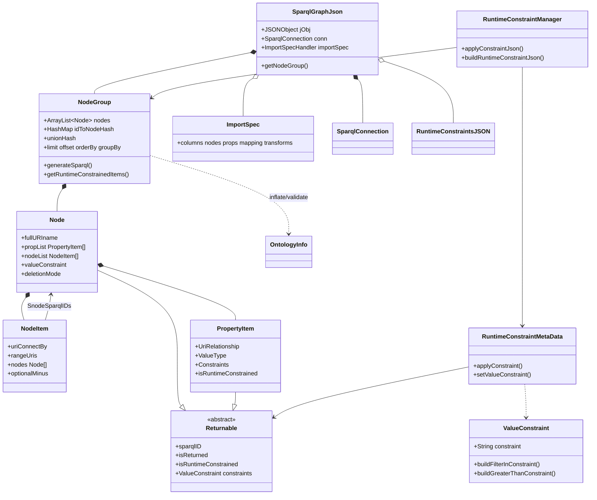
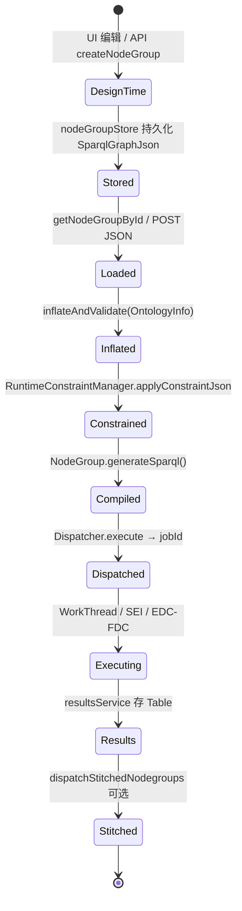
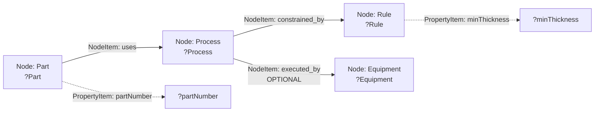
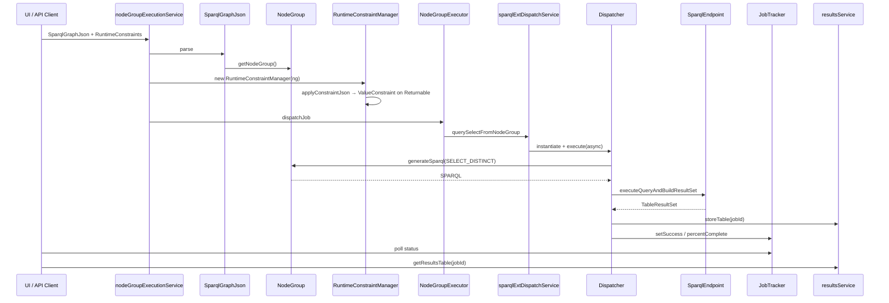
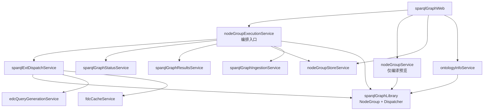
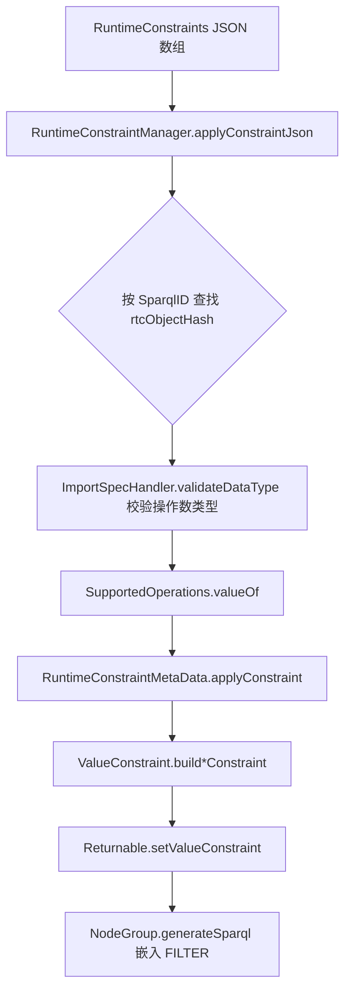
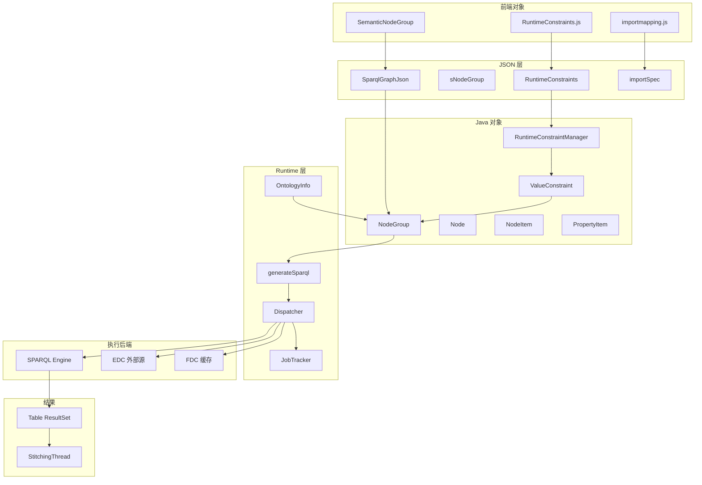
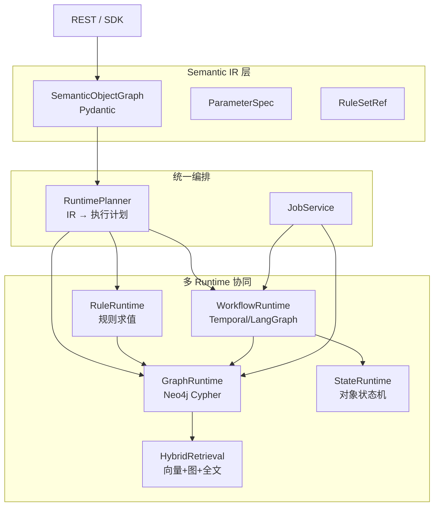
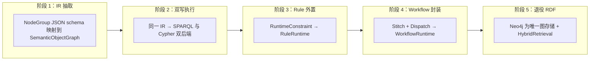

# SemTK NodeGroup 深度分析：工业语义运行时视角

> 基于 `semtk-master` 源码（belmont / runtimeConstraints / dispatch / SparqlGraphJson）  
> 前置阅读：[SemTK架构分析.md](./SemTK架构分析.md)

---

## 核心结论（先读）

| 命题 | 判断 |
|------|------|
| NodeGroup 只是 SPARQL Builder？ | **否**。它是 **本体绑定的语义对象查询图 IR**，SPARQL 只是其 **后端 lowering 目标之一**。 |
| NodeGroup 是 Workflow DAG？ | **否**。无步骤、无状态机、无任务依赖；`dispatchStitchedNodegroups` 是 **多查询结果表拼接**，不是图工作流。 |
| NodeGroup 是 Ontology Runtime IR？ | **部分是**。具备 **类/关系/约束槽位 + 参数化 + 多查询编排**，但缺少 **规则推理、时序、状态、副作用编排**。 |
| RuntimeConstraint 是工业规则系统？ | **否**。是 **查询参数绑定 → SPARQL FILTER** 的薄层，**不能**表达跨对象禁止、工序先后、工艺链规则。 |

---

## 一、NodeGroup 完整数据结构

### 1.1 对象关系图（UML 风格）



### 1.2 SparqlGraphJson 外层结构

`SparqlGraphJson` 是 **运行时部署单元**（可存 nodeGroupStore），键定义见源码：

| JSON 键 | Java 常量 | 职责 |
|---------|-----------|------|
| `sNodeGroup` | `JKEY_NODEGROUP` | 语义查询图本体 |
| `sparqlConn` | `JKEY_SPARQLCONN` | 三元组库连接（model/data graph、owlImports） |
| `importSpec` | `JKEY_IMPORTSPEC` | CSV→RDF 摄取语义映射（可选） |
| `RuntimeConstraints` | `JKEY_RUNTIMECONST` | 执行前注入的约束 JSON（可选） |
| `plotSpecs` | `JKEY_PLOTSPECS` | 可视化规格（可选） |

### 1.3 sNodeGroup 内部结构（version 20）

| 字段 | 类型 | 职责 |
|------|------|------|
| `sNodeList` | `Node[]` | 所有类节点（平铺列表，通过 NodeItem 引用连接） |
| `unionHash` | `Map<int, branchPoints>` | UNION 分支：多路径析取 |
| `limit` / `offset` | int | 分页 |
| `orderBy` / `groupBy` | array | 聚合与排序 |
| `columnOrder` | array | 结果列顺序 |
| `queryType` / `returnTypeOverride` | enum | 查询形态覆盖 |

### 1.4 Node（SemanticNode / 类节点）

| 字段 | 职责 |
|------|------|
| `NodeName` / `fullURIName` | OWL 类本地名与 URI（**本体绑定**） |
| `SparqlID` | 查询变量，如 `?Part` |
| `propList` | 该实例上的 **数据属性** |
| `nodeList` | 该实例发出的 **对象属性边** |
| `isReturned` | 是否出现在 SELECT |
| `valueConstraint` | 节点级 FILTER（静态） |
| `isRuntimeConstrained` | 是否允许运行时参数注入 |
| `deletionMode` | DELETE 查询时的删除策略 |
| `instanceValue` | 绑定到具体 URI 实例（非变量） |

### 1.5 PropertyItem（数据属性）

| 字段 | 职责 |
|------|------|
| `KeyName` / `UriRelationship` | 属性名与谓词 URI |
| `ValueType` / `valueTypes` | XSD 类型（校验与 FILTER 生成） |
| `SparqlID` / `isReturned` | 绑定变量与投影 |
| `Constraints` | 静态 `ValueConstraint` 字符串（如 `FILTER regex(...)`） |
| `isRuntimeConstrained` | 运行时约束槽位 |
| `optMinus` | OPTIONAL/MINUS 修饰 |

### 1.6 NodeItem（对象属性边）

| 字段 | 职责 |
|------|------|
| `ConnectBy` / `UriConnectBy` | 关系名与谓词 URI（如 `uses`、`constrained_by`） |
| `range` / `UriValueType` | 目标类 URI 集合 |
| `SnodeSparqlIDs` | 子节点变量列表 |
| `OptionalMinus` | `0` 必选 / `1` OPTIONAL / `2` MINUS |
| `DeletionMarkers` | 删除图标记 |

### 1.7 JSON 示例：工业对象关系（概念性）

SemTK 仓库无完整 `Part→Process→Rule→Equipment` 样例，但结构如下（与 `demoNodegroup.json` / FDC 样本同构）：

```json
{
  "sparqlConn": { "name": "mfg", "enableOwlImports": true, "model": [...], "data": [...] },
  "sNodeGroup": {
    "sNodeList": [
      {
        "NodeName": "Part",
        "fullURIName": "http://example/mfg#Part",
        "SparqlID": "?Part",
        "isReturned": true,
        "isRuntimeConstrained": false,
        "propList": [
          {
            "KeyName": "partNumber",
            "UriRelationship": "http://example/mfg#partNumber",
            "ValueType": "string",
            "SparqlID": "?partNumber",
            "isReturned": true,
            "isRuntimeConstrained": true,
            "Constraints": ""
          }
        ],
        "nodeList": [
          {
            "ConnectBy": "uses",
            "UriConnectBy": "http://example/mfg#uses",
            "range": ["http://example/mfg#Process"],
            "SnodeSparqlIDs": ["?Process"],
            "OptionalMinus": 0
          }
        ]
      },
      {
        "NodeName": "Process",
        "fullURIName": "http://example/mfg#Process",
        "SparqlID": "?Process",
        "nodeList": [
          {
            "ConnectBy": "constrained_by",
            "UriConnectBy": "http://example/mfg#constrained_by",
            "SnodeSparqlIDs": ["?Rule"],
            "OptionalMinus": 0
          },
          {
            "ConnectBy": "executed_by",
            "UriConnectBy": "http://example/mfg#executed_by",
            "SnodeSparqlIDs": ["?Equipment"],
            "OptionalMinus": 1
          }
        ],
        "propList": []
      },
      {
        "NodeName": "Rule",
        "fullURIName": "http://example/mfg#Rule",
        "SparqlID": "?Rule",
        "propList": [
          {
            "KeyName": "minThickness",
            "UriRelationship": "http://example/mfg#minThickness",
            "ValueType": "double",
            "SparqlID": "?minThickness",
            "isRuntimeConstrained": true,
            "Constraints": ""
          }
        ],
        "nodeList": []
      },
      {
        "NodeName": "Equipment",
        "fullURIName": "http://example/mfg#Equipment",
        "SparqlID": "?Equipment",
        "propList": [],
        "nodeList": []
      }
    ]
  },
  "RuntimeConstraints": [
    {
      "SparqlID": "?partNumber",
      "Operator": "MATCHES",
      "Operands": ["PN-2024-001"]
    },
    {
      "SparqlID": "?minThickness",
      "Operator": "GREATERTHAN",
      "Operands": ["5.0"]
    }
  ]
}
```

### 1.8 RuntimeConstraint JSON 结构

前端 `runtimeconstraints.js` 与 Java `RuntimeConstraintManager` 对齐：

```json
{
  "SparqlID": "?Value",
  "Operator": "GREATERTHAN",
  "Operands": ["200"]
}
```

**支持算子**（`SupportedOperations`）：

| Operator | 含义 | 操作数 |
|----------|------|--------|
| `MATCHES` / `NOTMATCHES` | IN / NOT IN | 1–1000 |
| `REGEX` | 正则 | 1 |
| `GREATERTHAN` / `GREATERTHANOREQUALS` | > / >= | 1 |
| `LESSTHAN` / `LESSTHANOREQUALS` | < / <= | 1 |
| `VALUEBETWEEN` / `VALUEBETWEENUNINCLUSIVE` | 区间 | 2 |

### 1.9 ImportSpec 结构（摄取侧语义映射）

| 区块 | 职责 |
|------|------|
| `columns` | CSV 列定义 |
| `nodes` | 目标 Node 的 sparqlID、类型、URI 查找模式 |
| `props` | 属性映射目标 |
| `mapping` | 列/文本 → node/prop |
| `transforms` | 列变换 |
| `URILookupMode` | `noCreate` / `createIfMissing` / `errorIfExists` |

ImportSpec 使 NodeGroup 同时成为 **写入计划**（ingest），不仅是查询计划。

---

## 二、运行时生命周期



| 阶段 | 组件 | 状态变化 |
|------|------|----------|
| 设计时 | sparqlGraphWeb / belmont.js | 图结构 + `isRuntimeConstrained` 标记 |
| 持久化 | nodeGroupStoreService | 完整 SparqlGraphJson |
| 加载 | SparqlGraphJson.getNodeGroup() | JSON → Java 对象图 |
| 本体对齐 | OntologyInfo.inflate | URI 校验、range 补全 |
| 参数化 | RuntimeConstraintManager | JSON → `ValueConstraint` 写入 Returnable |
| 编译 | generateSparql | IR → SPARQL 文本（**不可逆信息损失**：只剩 FILTER/三元组） |
| 执行 | Dispatcher + JobTracker | 异步 job、进度、结果表 |
| 编排 | StitchingThread | 多 job 结果 **按列 key 拼接** |

---

## 三、NodeGroup 是不是「语义对象查询图」？

### 3.1 是 — 证据

1. **节点 = 本体类实例变量**，边 = **OWL 对象属性**，属性 = **数据属性**，全部带 URI。
2. **与 OntologyInfo 双向绑定**：`inflateAndValidate`、`suggestNodeClass`、`findAllPaths` 依赖类层次与 domain/range。
3. **支持 OPTIONAL/MINUS/UNION**：表达存在性、否定、分支，是 **声明式子图模式**，不是 SQL 表连接列表。
4. **Returnable 抽象**：统一处理「哪些绑定参与 SELECT / FILTER / 运行时参数」。
5. **ImportSpec**：同一图结构支撑 **对象写入**，超出纯查询。

### 3.2 不完全是 — 边界

- **无实例身份推理**：不包含 SPARQL 之外的 OWL 推理机；`enableOwlImports` 交给 triplestore。
- **无过程语义**：`uses`、`executed_by` 只是 **关系边**，不表达 **BEFORE/AFTER**、活动持续时间。
- **无运行时对象状态**：查询返回绑定，不维护 Part 的 `status=IN_PROCESS` 状态机。
- **编译后降级为 SPARQL**：工业语义在 lowering 后只剩三元组与 FILTER。

**定义建议**：

> **NodeGroup = Ontology-anchored Semantic Object Query Graph (SOQG)**  
> 一种以 OWL 类/属性为 schema、以图模式表达对象关系的 **声明式查询 IR**，可参数化、可摄取、可编译为 SPARQL。

---

## 四、工业对象关系网络如何形成

### 4.1 结构要素协同



| 机制 | 在工业网络中的作用 |
|------|-------------------|
| **类节点** | 抽象设备类型（Part、Process、Equipment） |
| **对象属性边 NodeItem** | 工艺链、约束关联、归属（`belongs_to` 同构于任意 ObjectProperty） |
| **数据属性 PropertyItem** | 厚度、材料牌号、参数阈值 |
| **静态 Constraints** | 设计时 FILTER（如 `regex` 过滤标准号） |
| **RuntimeConstraint** | 执行时参数（工单号、批次、阈值） |
| **Path（OntologyInfo）** | 自动发现类间可达路径并 **生成** NodeGroup（PathExplorer） |
| **unionHash** | 多工艺路线析取（OR 分支） |

### 4.2 与 Neo4j / Workflow DAG / State Graph 的本质区别

| 维度 | SemTK NodeGroup | Neo4j Property Graph | Workflow DAG (Airflow/Dify) | Runtime State Graph (LangGraph) |
|------|-----------------|----------------------|----------------------------|--------------------------------|
| **主语义** | OWL 类上的 **查询模式** | 带标签属性的 **实例图** | **任务步骤** 与依赖 | **状态节点** 与转移 |
| **边含义** | 本体关系 + 可选/否定 | 任意关系类型 | `depends_on` / 数据流 | `next` / 条件边 |
| **执行** | 编译 SPARQL 一次查询 | Cypher 遍历 | 按拓扑调度任务 | 逐步推进 state |
| **时间/顺序** | ❌ 不原生支持 | 需建模为关系或属性 | ✅ 核心 | ✅ 核心 |
| **规则** | FILTER 级 | 需 APOC/应用层 | 条件节点 | 条件边 + reducer |
| **参数化** | RuntimeConstraint → FILTER | 查询参数 | 运行时变量 | State 字段 |
| **结果** | 绑定表（Table） | 子图/路径 | 任务 XCom / 输出 | 更新后的 State |

**关键差异**：NodeGroup 描述的是 **「世界是什么样（查询）」**，不是 **「接下来做什么（编排）」**。工业工艺链若需 `粗加工 BEFORE 热处理`，在 SemTK 中必须：

- 将顺序建模为 **本体关系或时间戳属性**，再用 FILTER/多跳查询表达；或
- 在 SemTK **之外** 用规则引擎/工作流处理。

---

## 五、NodeGroup 查询 Runtime 完整调用链

### 5.1 调用链（SELECT）

```
sparqlGraphWeb (SemanticNodeGroup.toJson)
  → nodeGroupExecutionService.dispatchSelectFromNodegroup
    → SparqlGraphJson.parse
    → NodeGroup.getInstanceFromJson
    → RuntimeConstraintManager.applyConstraintJson (可选)
    → NodeGroupExecutor.dispatchJob
      → sparqlExtDispatchService /dispatcher/querySelectFromNodeGroup
        → DispatchServiceManager.getDispatcher()  // Plain | Edc | Fdc
        → WorkThread.run
          → AsynchronousNodeGroupBasedQueryDispatcher.execute
            → getSparqlQuery(SELECT_DISTINCT)
              → NodeGroup.generateSparql()
            → executePlainSparqlQuery
              → SparqlEndpointInterface.executeQueryAndBuildResultSet
            → ResultsClient.execStoreTableResults(jobId, table)
  ← statusService.getPercentComplete(jobId)
  ← resultsService.getResultsTable(jobId)
```

### 5.2 Runtime 时序图



### 5.3 服务依赖图



### 5.4 NodeGroup 作为 Runtime IR 的判定

| IR 特征 | NodeGroup 是否具备 | 说明 |
|---------|-------------------|------|
| 与实现无关的中间表示 | ✅ 部分 | JSON 可存取、可版本化 |
| 多后端 lowering | ⚠️ 仅 SPARQL 为主 | EDC/FDC 是 **执行期扩展**，非第二 IR |
| 控制流 | ❌ | 无分支调度，仅 UNION 查询分支 |
| 数据流 | ⚠️ | SELECT 投影；Stitch 是 **表级** 后处理 |
| 副作用 | ⚠️ | CONSTRUCT/DELETE/ingest 另路径 |
| 参数化 | ✅ | RuntimeConstraint |
| 类型/schema 绑定 | ✅ | OntologyInfo |

**结论**：NodeGroup 最接近 **「声明式图查询 IR + 参数槽」**（类似 SQL AST / GraphQL selection set），**不是** Airflow/LangGraph 级 Workflow IR。  
与 **Compiler IR** 类比：像 **高级查询 IR**，在 `generateSparql()` 时 **单次 lowering** 到 SPARQL，无优化器 pass 链。

---

## 六、RuntimeConstraint 深度研究（最重要）

### 6.1 注入流程



源码要点（`RuntimeConstraintMetaData.applyConstraint`）：

- `GREATERTHAN` → `ValueConstraint.buildGreaterThanConstraint`
- `MATCHES` → `buildFilterInConstraint`
- 最终都是 **字符串 FILTER 片段**，写入 `Returnable.constraints`

### 6.2 与「工业规则」对照

| 规则类型 | 示例 | RuntimeConstraint 能否表达 |
|----------|------|---------------------------|
| 属性阈值 | 厚度 > 5mm | ✅ `GREATERTHAN` on `?thickness` |
| 枚举限制 | 材料 ∈ {A, B} | ✅ `MATCHES` |
| 单对象正则 | 标准号匹配 HB-* | ✅ `REGEX` |
| 跨对象禁止 | 材料A 禁止 工艺B | ❌ 需多跳 + 复杂 FILTER，无第一公民 |
| 时序 | 粗加工 BEFORE 热处理 | ❌ 无时序算子 |
| 全局不变式 | 凡热处理前必须探伤 | ❌ 无规则引擎、无 forward chaining |
| 动作/副作用 | 违规则拦截下发 MES | ❌ 仅查询过滤，无 action |

### 6.3 距离真正 Rule Runtime 还差什么

| 能力 | SemTK 现状 | 工业 Rule Runtime 需要 |
|------|------------|------------------------|
| 规则语言 | SPARQL FILTER 片段 | DSL（SWRL / DMN / 自定义） |
| 规则作用域 | 单变量绑定 | 多对象、量词、聚合 |
| 时序/事件 | 无 | Allen 代数 / 工序序 |
| 冲突解决 | 无 | 优先级、否决 |
| 解释与追溯 | 无 | 为何命中/未命中 |
| 与执行解耦 | 编译进查询 | 规则层 → 查询/动作 分离 |
| 热更新 | 改 NodeGroup JSON | 规则库版本管理 |

**结论**：RuntimeConstraint 是 **「参数化查询过滤器」**，不是 Rule Runtime；最多算 **Constraint Runtime 的雏形（10%）**。

---

## 七、NodeGroup 与 Workflow Runtime 对照

| 系统 | 对应概念 | 与 NodeGroup 关系 |
|------|----------|-------------------|
| **SemTK NodeGroup** | Semantic Object Query Graph IR | 本体 |
| **Dify Workflow** | 节点 DAG + 变量池 + LLM/工具 | NodeGroup **无**步骤节点；Dify 是 **过程编排** |
| **LangGraph StateGraph** | State + 条件边 + reducer | NodeGroup **无** state 演进 |
| **Airflow DAG** | Task 依赖 + 调度 | `dispatchStitched` 仅 **结果表 join**，非 task DAG |
| **Temporal** |  durable workflow + activity | SemTK job 无持久工作流语义 |
| **Neo4j Property Graph** | 实例 + 关系 | NodeGroup 是 **模式** 不是 **数据图** |
| **Compiler IR** | SSA / AST | NodeGroup 像 **查询 AST**，单次 lowering |

### 7.1 NodeGroup 更接近什么？

```text
NodeGroup ≈ Ontology-typed Graph Query IR
          + Parameter Binding Layer (RuntimeConstraint)
          + Optional Multi-Query Result Stitching
          + Ingest Mapping (ImportSpec)
```

**是否接近 Ontology Runtime IR？**  
→ **是「查询子集」的 Ontology Runtime IR**，不是完整 Ontology Runtime（缺规则、状态、动作、事件）。

---

## 八、架构图汇总

### 8.1 SemTK NodeGroup 全栈架构



### 8.2 NodeGroup Runtime 流水线（抽象）

```text
UI 编辑语义图
    ↓
SparqlGraphJson（持久化/传输）
    ↓
Ontology 对齐（inflate / validate）
    ↓
Runtime Constraint 注入（参数绑定）
    ↓
Query Planner（generateSparql — 实为 Compiler）
    ↓
Dispatch Runtime（Job + 异步线程）
    ↓
Query Execution（SPARQL / EDC / FDC）
    ↓
Result Merge（Table / Stitch）
```

---

## 九、现代 Runtime 重构设计（抛弃 RDF/SPARQL）

### 9.1 设计原则

| SemTK 保留 | 抛弃 | 替换 |
|------------|------|------|
| 图结构 IR | OWL URI 强绑定 | Pydantic 模型 + schema registry |
| 类节点 / 关系边 / 属性 | SPARQL 编译 | Cypher / 内部 GraphExecutor |
| RuntimeConstraint 槽位 | FILTER 字符串 | RuleEngine 谓词 |
| ImportSpec 映射 | RDF 三元组写入 | Neo4j MERGE + 属性图 |
| Job + Status + Results | Triplestore | Neo4j + Redis job store |
| Stitch 多查询 | — | Workflow 或 ResultJoin 节点 |

### 9.2 目标架构：Runtime-first Industrial Ontology System



### 9.3 核心对象结构（Pydantic）

```python
# semantic_ir/models.py
from pydantic import BaseModel
from enum import Enum
from typing import Optional

class Cardinality(str, Enum):
    REQUIRED = "required"
    OPTIONAL = "optional"
    NEGATED = "negated"  # 对应 MINUS

class DataSlot(BaseModel):
    name: str
    dtype: str  # string | float | ...
    returned: bool = False
    static_filter: Optional[str] = None  # 设计时
    runtime_param: bool = False          # 对应 isRuntimeConstrained

class RelationEdge(BaseModel):
    predicate: str          # uses | constrained_by | executed_by
    target_type: str        # Process | Rule
    cardinality: Cardinality = Cardinality.REQUIRED
    target_var: str

class ObjectPattern(BaseModel):
    type: str               # Part | Process
    var: str                # part_1
    returned: bool = True
    properties: list[DataSlot] = []
    relations: list[RelationEdge] = []

class SemanticObjectGraph(BaseModel):
    """现代版 NodeGroup"""
    version: int = 1
    patterns: list[ObjectPattern]
    unions: list[list[str]] = []  # 可选分支 pattern var 组
    limit: int = 0
    runtime_params: dict[str, "RuntimeParam"] = {}

class RuntimeParam(BaseModel):
    var: str
    op: str  # gt | in | regex | between
    operands: list[str]
```

### 9.4 Runtime 结构

```python
# runtime/planner.py
class RuntimePlanner:
  def plan(self, ir: SemanticObjectGraph, mode: str) -> ExecutionPlan:
    """
    mode: query | ingest | validate | workflow
  """
    # 1. schema 校验（替代 OntologyInfo）
    # 2. 注入 runtime_params → RuleRuntime 或 QueryFilter
    # 3. lowering:
    #    - query  → CypherPlan
    #    - validate → RulePlan
    #    - workflow → WorkflowPlan (多步)
```

```python
# runtime/graph_runtime.py
class GraphRuntime:
  def execute(self, plan: CypherPlan) -> GraphResult:
    # Neo4j session.run(...)
    pass
```

```python
# runtime/rule_runtime.py
class RuleRuntime:
  def evaluate(self, rules: RuleSet, ctx: ObjectContext) -> RuleVerdict:
    """
    支持：
    - forbid(material=A, process=B)
    - require(thickness > 5, process=heat_treat)
    - before(op=rough_machining, op=heat_treat)
    """
    pass
```

```python
# runtime/workflow_runtime.py
class WorkflowRuntime:
  async def run(self, plan: WorkflowPlan, state: IndustrialState):
    # 类似 LangGraph：检索 → 规则校验 → 图查询 → 写回状态
    pass
```

```python
# runtime/state_runtime.py
class IndustrialState(BaseModel):
  work_order_id: str
  part_refs: list[str]
  phase: str  # PLANNED | IN_PROCESS | QA
  last_rule_results: list[RuleVerdict]
```

### 9.5 工业规则示例（现代 Rule Runtime）

```python
# rules/mfg_rules.py
rules = [
  Rule(
    id="no_material_A_on_process_B",
    when=Match(patterns=[
      ObjectPattern(type="Part", var="p", relations=[
        RelationEdge(predicate="uses", target_type="Process", target_var="proc"),
      ]),
      ObjectPattern(type="Process", var="proc", properties=[
        DataSlot(name="processCode", runtime_param=True)
      ]),
    ]),
    forbid=lambda ctx: (
      ctx.get("p.material") == "A" and ctx.get("proc.processCode") == "B"
    ),
  ),
  Rule(
    id="thickness_before_heat_treat",
    when=Temporal(before="rough_machining", after="heat_treat"),
    require=lambda ctx: ctx.get("thickness") > 5.0,
  ),
]
```

### 9.6 从 Semantic-first 到 Runtime-first 迁移路径



| 阶段 | SemTK 概念 | 现代对应 |
|------|-----------|----------|
| 1 | sNodeList | `ObjectPattern[]` |
| 2 | generateSparql | `CypherBuilder.lower(ir)` |
| 3 | RuntimeConstraint | `RuleRuntime.evaluate` |
| 4 | dispatchStitched | `WorkflowRuntime` 子图 |
| 5 | ImportSpec ingest | `GraphRuntime.merge` + ETL |

### 9.7 Hybrid Retrieval 集成（对接 RAG-Anything）

```text
User Query
    ↓
WorkflowRuntime
    ├─ HybridRetrieval（Milvus 向量 + Neo4j 子图 + 全文）
    ├─ SemanticObjectGraph（结构化过滤，替代 NodeGroup）
    ├─ RuleRuntime（工艺合规）
    └─ StateRuntime（工单/零件状态）
    ↓
Answer + Evidence（chunk + graph path + rule trace）
```

---

## 十、最终回答：NodeGroup 是否已是 Ontology Runtime IR？

| 层次 | 评价 |
|------|------|
| **作为查询 IR** | ✅ 成熟：图模式 + 本体绑定 + 参数化 + 多查询拼接 |
| **作为 Graph Runtime** | ⚠️ 依赖 SPARQL 引擎，自身不执行图遍历 |
| **作为 Workflow Runtime** | ❌ 仅 Stitch，无步骤语义 |
| **作为 Rule Runtime** | ❌ RuntimeConstraint ≠ 规则 |
| **作为 State Runtime** | ❌ 无对象生命周期 |
| **作为 Ontology Runtime IR** | ⚠️ **子集**：覆盖 **schema-typed declarative query**，不覆盖 **推理 / 规则 / 过程 / 状态** |

**一句话**：

> SemTK NodeGroup 是 **工业语义世界里的「对象查询中间表示」**，是走向 Ontology Runtime 的 **重要前半段**；要成为完整 **Runtime-first Industrial Ontology System**，必须在 IR 之上叠加 **RuleRuntime、WorkflowRuntime、StateRuntime**，并以 **属性图执行引擎** 替代 SPARQL lowering 作为默认后端。

---

## 附录：关键源码索引

| 主题 | 文件 |
|------|------|
| NodeGroup IR | `sparqlGraphLibrary/.../belmont/NodeGroup.java` |
| 运行时约束 | `.../runtimeConstraints/RuntimeConstraintManager.java` |
| 约束 → FILTER | `.../runtimeConstraints/RuntimeConstraintMetaData.java` |
| FILTER 构建 | `.../belmont/ValueConstraint.java` |
| 部署 JSON | `.../load/utility/SparqlGraphJson.java` |
| 摄取映射 | `.../load/utility/ImportSpec.java` |
| 前端约束 | `sparqlGraphWeb/sparqlGraph/js/runtimeconstraints.js` |
| SPARQL 编译入口 | `NodeGroup.generateSparql()` |
| Dispatch | `.../asynchronousQuery/AsynchronousNodeGroupBasedQueryDispatcher.java` |
| 多查询拼接 | `.../api/nodeGroupExecution/StitchingThread.java` |
| 编排客户端 | `.../api/nodeGroupExecution/NodeGroupExecutor.java` |


已生成深度分析文档：

semtk-master/SemTK-NodeGroup-Runtime深度分析.md

文档从 工业语义运行时 视角展开，主要内容如下：

核心判断
NodeGroup ≠ 单纯 SPARQL Builder
它是 本体绑定的语义对象查询图（SOQG）：类节点 + 对象边 + 数据属性 + 参数槽 + 可选摄取映射。

NodeGroup ≈ 部分 Ontology Runtime IR
覆盖「声明式对象查询 + 参数化」，不覆盖 规则推理、工序时序、状态机、任务编排。

RuntimeConstraint ≠ 工业规则系统
只是 SparqlID + Operator + Operands → ValueConstraint → SPARQL FILTER；不能表达「材料 A 禁止工艺 B」「粗加工 BEFORE 热处理」等跨对象/时序规则。

文档包含的交付物
章节	内容
对象关系图
SparqlGraphJson / NodeGroup / Node / NodeItem / RuntimeConstraint 全结构
工业关系示例
Part→Process→Rule→Equipment 概念 JSON
生命周期
设计→存储→inflate→约束注入→编译→Dispatch→Stitch
与 Neo4j/DAG/LangGraph 对比
本质差异表
完整调用链 + 时序图 + 服务依赖图
RuntimeConstraint 注入流程
及与 Rule Runtime 差距
现代重构设计
Neo4j + Pydantic + Graph/Rule/Workflow/State Runtime
迁移路径
Semantic-first → Runtime-first 五阶段
对你 RAG-Anything 最有用的结论
若要把 SemTK 思想迁到当前工作流，建议保留 SemanticObjectGraph IR（类似 NodeGroup），把 RuntimeConstraint 升级为独立 RuleRuntime，用 Neo4j 执行图查询，用现有 Workflow Runtime 做编排，而不是继续以 SPARQL 为唯一执行后端。

如需把该设计与 RAG-Anything 的 graph_retrieve_node / entity-relation 做一一映射表，可以说明要对接的节点名，我可以补一节到同一文档里。