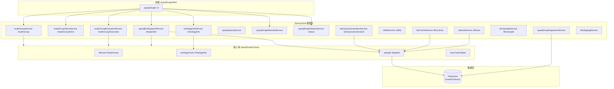
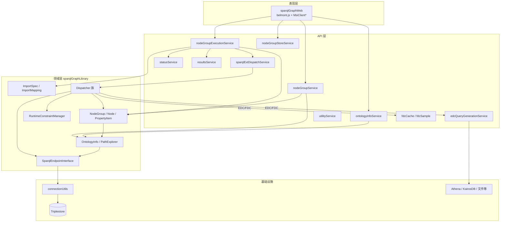
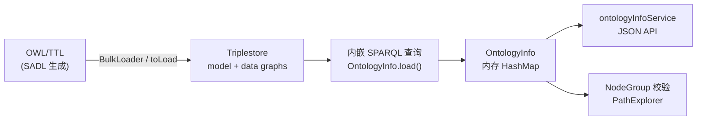
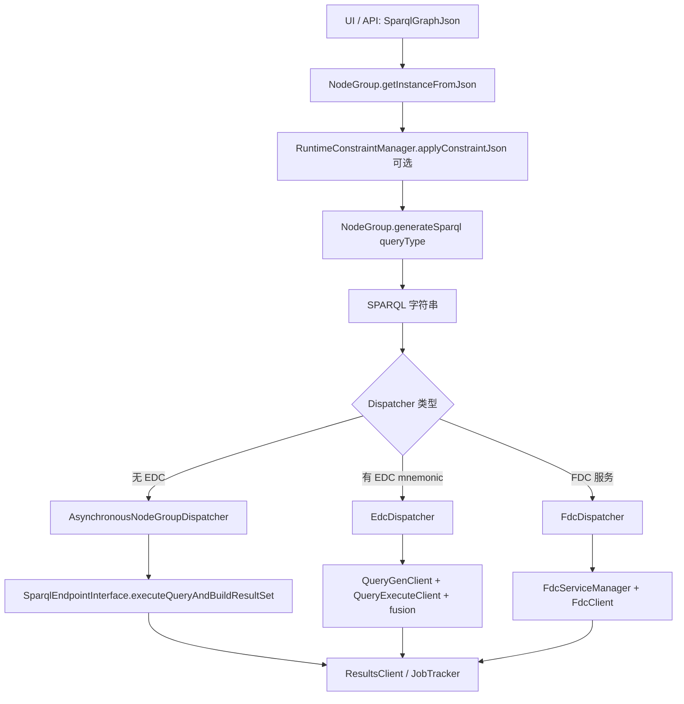
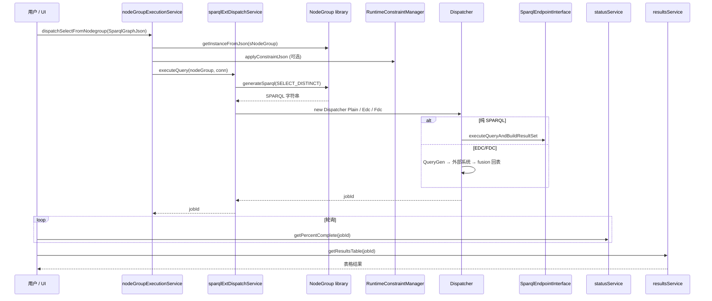

# SemTK 整体架构分析

> 基于 `semtk-master`（SemTK 2.5.0-SNAPSHOT）源码梳理  
> 生成日期：2026-05-16

---

## 一、总体定位

**SemTK（Semantics Toolkit）** 是 GE Research 开源的语义/SPARQL 工具栈：用 **OWL 本体** 定义领域模型，用 **NodeGroup（语义图 JSON）** 表达查询意图，由 Java 库 **确定性生成 SPARQL**，经微服务异步执行，可选接 **EDC（外部时序/数仓）** 与 **FDC（联邦特征缓存）**。

核心设计原则：**本体在 Triplestore 中，内存用 SPARQL 反查构建 `OntologyInfo`；查询不用自然语言，而用图结构 JSON。**

官方文档：[SemTK Wiki](https://github.com/ge-semtk/semtk/wiki/Home)

---

## 二、前端结构（`sparqlGraphWeb`）

```
sparqlGraphWeb/
├── ROOT/index.html                    # 入口
├── sparqlGraph/
│   ├── main-oss/sparqlGraph.html      # 主应用（RequireJS）
│   ├── main-oss/sparqlgraphconfigOss.js  # 各微服务 URL 配置
│   └── js/
│       ├── belmont.js                 # SemanticNodeGroup / Node / PropertyItem（与 Java 对齐）
│       ├── sparqlgraph.js             # 主 UI：画布、Tab、服务调用
│       ├── sparqlgraphjson.js         # SparqlGraphJson 读写
│       ├── nodegrouprenderer.js       # Vis.js 图渲染
│       ├── runtimeconstraints.js      # 运行时约束 UI
│       ├── importmapping.js / mappingitem.js / importspec.js  # CSV 语义映射
│       ├── msiclient*.js              # 各 REST 微服务客户端
│       └── exploretab.js / reporttab.js / uploadtab.js
└── iidx-oss/                          # GE Bootstrap UI 组件库
```

| 前端概念 | Java 对应 | 职责 |
|---------|-----------|------|
| `SemanticNodeGroup` | `belmont.NodeGroup` | 语义查询图 |
| `SemanticNode` | `belmont.Node` | OWL 类节点 |
| `PropertyItem` / `NodeItem` | 同名 Java 类 | 数据属性 / 对象属性边 |
| `SparqlGraphJson` | `load.utility.SparqlGraphJson` | 完整包：`sNodeGroup` + `sparqlConn` + `importSpec` |

**前端数据流**：Vis 画布编辑 → `toJson()` → `MsiClientNodeGroupService`（仅生成 SPARQL）或 `MsiClientNodeGroupExec`（dispatch）→ `MsiClientStatus` 轮询 → `MsiClientResults` 取表/图。

---

## 三、后端微服务结构

Maven 多模块（根 `pom.xml`），Spring Boot 2.7.5，各服务独立 JAR，由 `startServices.sh` 启动。

### 3.1 模块列表

| 模块 | 路径前缀 | 核心职责 |
|------|----------|----------|
| **sparqlGraphLibrary** | — | 核心库：NodeGroup、OntologyInfo、Dispatch、EDC/FDC |
| **connectionUtils** | — | `SparqlEndpointInterface`、鉴权、结果集 |
| **ontologyInfoService** | `/ontologyinfo` | 本体 JSON、类信息、数据字典、路径统计 |
| **nodeGroupService** | `/nodeGroup` | 生成 SPARQL、路径查找、校验、运行时约束元数据 |
| **nodeGroupStoreService** | `/nodeGroupStore` | 持久化 NodeGroup / ImportSpec / PlotSpec |
| **nodeGroupExecutionService** | `/nodeGroupExecution` | 高层编排：dispatch、ingest、stitch、结果表 |
| **sparqlExtDispatchService** | `/dispatcher` | 异步作业：NodeGroup → 执行 |
| **sparqlGraphStatusService** | `/status` | 作业进度 jobId |
| **sparqlGraphResultsService** | — | 查询结果 |
| **sparqlGraphIngestionService** | — | 数据摄取 |
| **sparqlQueryService** | — | 原始 SPARQL |
| **utilityService** | `/utility` | EDC/FDC 管理、SHACL、导入包 |
| **edcQueryGenerationService** | `/edcQueryGeneration` | KairosDB/Athena/Hive 查询生成 |
| **fdcCacheService** | `/fdcCache` | FDC 缓存规格执行 |
| **fdcSampleService** | `/fdcSample` | 航空 FDC 演示 |
| **athenaService** | `/athena` | Athena 查询 |
| **fileStagingService** | — | 文件暂存 |
| **standaloneExecutables** | — | BulkLoader 等 CLI |
| **springUtilLibrary** / **springSecurityLibrary** | — | 共享 Spring 配置与安全 |

### 3.2 模块调用关系图



### 3.3 分层调用关系（详细）



---

## 四、Ontology 相关模块

### 4.1 包与类

| 包/类 | 路径 | 职责 |
|-------|------|------|
| **OntologyInfo** | `ontologyTools/OntologyInfo.java` | 本体“大脑”：类/属性/子类/枚举/路径 |
| **OntologyClass** | 同上包 | OWL 类 + 挂载属性列表 |
| **OntologyProperty** | 同上包 | 对象/数据属性，按 domain 存 range |
| **OntologyRange** / **OntologyDatatype** | 同上包 | 属性值域、XSD 类型 |
| **OntologyPath** / **PathExplorer** | 同上包 | 类间路径、自动建 NodeGroup |
| **OntologyInfoCache** | 同上包 | 按 `SparqlConnection` 缓存 |
| **RestrictionChecker** | 同上包 | OWL 基数等约束检查 |
| **BulkLoader** | `standaloneExecutables` | OWL/TTL → Triplestore |
| **OntologyInfoClient** | `edc.client` | 调用 ontologyInfoService 的 HTTP 客户端 |

**命名说明**：代码库中**没有**名为 `Ontology` 或 `Property` 的类；对应为 **`OntologyInfo`** 与 **`OntologyProperty`**。`belmont.PropertyItem` 是 NodeGroup 查询图里的属性边，不是 OWL Property 本身。

### 4.2 本体对象如何组织

SemTK **不在 Java 里用 Jena `OntModel` 做主业务模型**，而是：



**`OntologyInfo.load()` 顺序（节选）**：

1. `owl:imports` 递归加载（可选 `enableOwlImports`）
2. 子类 / 顶层类
3. Datatype
4. Properties（Domain / Property / Range）
5. 子属性、枚举、label/comment
6. `validate()`

**内存结构**：

```
OntologyInfo
├── classHash: Map<uri, OntologyClass>
├── propertyHash: Map<uri, OntologyProperty>
├── datatypeHash: Map<uri, OntologyDatatype>
├── subclassHash / superclassNamesSpeedup
├── subPropHash / superPropNamesSpeedup
├── enumerationHash
└── connHash（路径查找临时连接）
```

`OntologyClass` 持有 `ArrayList<OntologyProperty>`；`OntologyProperty` 用 `Hashtable<domainUri, OntologyRange>` 存 domain-specific range。

**Bundled OWL 资源**：`sparqlGraphLibrary/src/main/resources/semantics/OwlModels/`

| 文件 | 用途 |
|------|------|
| `FederatedDataConnection.owl` | FDC 联邦数据连接 |
| `fdcServices.owl` | FDC 服务配置 |
| `hardware.owl` | 制造零件 demo |
| `EntityResolution.owl` | 实体解析 |
| `authorization.owl` | 权限 |

### 4.3 ontologyInfoService 主要端点

| 端点 | 说明 |
|------|------|
| `/getOntologyInfoJson` | 返回完整本体 JSON |
| `/getClassInfo` | 单类详情 |
| `/getDataDictionary` | 数据字典 |
| `/getInstanceDictionary` | 实例词典 |
| `/getPredicateStats` | 谓词使用统计 |
| `/getCardinalityViolations` | 基数违规 |
| `/getRdfOWL` / `/getSADL` | 从内存模型反向生成 |
| `/uncacheOntology` | 清除缓存 |

---

## 五、NodeGroup 相关模块

### 5.1 核心类（`com.ge.research.semtk.belmont`）

| 类 | 职责 |
|----|------|
| **NodeGroup** | 语义图根：`sNodeList`、`generateSparql()`、UNION、ORDER/GROUP |
| **Node** | OWL 类实例节点：`propList` + `nodeList` |
| **NodeItem** | 对象属性边 → 子 `Node`（含 OPTIONAL/MINUS） |
| **PropertyItem** | 数据属性：类型、URI、`Constraints`、`isReturned` |
| **ValueConstraint** | 静态 FILTER 片段 |
| **Returnable** | `Node`/`PropertyItem` 基类 |
| **SparqlGraphJson** | 外层 JSON 包装 |
| **ValidationAssistant** | 基于 `OntologyInfo` 校验 NodeGroup |

### 5.2 NodeGroup 如何表达语义查询

**完整 JSON 两层结构（SparqlGraphJson）**：

```json
{
  "sparqlConn": {
    "name": "daDemo",
    "domain": "",
    "model": [{ "type": "virtuoso", "url": "...", "graph": "..." }],
    "data": [{ "type": "virtuoso", "url": "...", "graph": "..." }],
    "enableOwlImports": true
  },
  "sNodeGroup": {
    "offset": 0,
    "sNodeList": [ /* Node 数组 */ ],
    "limit": null,
    "orderBy": [],
    "groupBy": [],
    "unionHash": {},
    "queryType": null
  },
  "importSpec": { /* 可选 */ },
  "RuntimeConstraints": [ /* 可选 */ ],
  "plotSpecs": { /* 可选 */ }
}
```

**每个 Node（`sNodeList` 中一项）**：

| 字段 | 含义 |
|------|------|
| `NodeName` / `fullURIName` | 类本地名 / 完整 OWL URI |
| `SparqlID` | 变量名，如 `?Aircraft` |
| `propList` | 数据属性列表（PropertyItem） |
| `nodeList` | 对象属性边列表（NodeItem） |
| `isReturned`, `valueConstraint` | SELECT 返回、节点级 FILTER |

**每个 PropertyItem（`propList` 项）**：

| 字段 | 含义 |
|------|------|
| `KeyName`, `UriRelationship` | 属性名与谓词 URI |
| `ValueType` | XSD 类型 |
| `SparqlID`, `isReturned` | 绑定变量与是否出现在 SELECT |
| `Constraints` | `ValueConstraint` 字符串（嵌入 WHERE FILTER） |
| `isRuntimeConstrained` | 是否接受运行时约束注入 |
| `optMinus` | OPTIONAL / MINUS 模式 |

**每个 NodeItem（`nodeList` 项）**：

| 字段 | 含义 |
|------|------|
| `ConnectBy` / `UriConnectBy` | 对象属性名与 URI |
| `range` / `UriValueType` | 目标类 URI |
| `SnodeSparqlIDs` | 连接的子节点 SparqlID 列表 |
| `OptionalMinus` | `0`=必选, `1`=OPTIONAL, `2`=MINUS |

**语义含义**：NodeGroup 表达 **“查哪些类、沿哪些关系连、哪些属性返回/过滤”** 的可视化子图，等价于 SPARQL `WHERE` 子图，**不是**自然语言查询。

### 5.3 服务模块

| 服务 | 典型 API |
|------|----------|
| **nodeGroupService** | `/generateSelect`, `/findAllPaths`, `/inflateAndValidate`, `/buildRuntimeConstraintJSON` |
| **nodeGroupStoreService** | `/storeNodeGroup`, `/getNodeGroupById`, `/getNodeGroupList` |
| **nodeGroupExecutionService** | `/dispatchSelectFromNodegroup`, `/ingestFromCsvStrings`, `/dispatchStitchedNodegroups` |

### 5.4 示例：FDC 航空查询

文件：`fdcSampleService/src/main/resources/nodegroups/fdcSampleAircraftLocation.json`

- `Aircraft` 节点：`tailNumber`（string）
- `AircraftLocation` 节点：`latitude`、`longitude`（double）
- 通过 `nodeList` 连接飞机与位置

---

## 六、Query Runtime 相关模块

### 6.1 核心组件

| 组件 | 包 | 职责 |
|------|-----|------|
| **NodeGroup.generateSparql()** | `belmont` | SELECT/COUNT/ASK/CONSTRUCT/DELETE |
| **AutoGeneratedQueryTypes** | `belmont` | 查询类型枚举 |
| **AsynchronousNodeGroupDispatcher** | `sparqlX.dispatch` | 纯 SPARQL 异步执行 |
| **EdcDispatcher** | `sparqlX.dispatch` | 外部系统查询 + 结果融合 |
| **FdcDispatcher** | `sparqlX.dispatch` | FDC 缓存/派生（距离、海拔） |
| **DispatchServiceManager** | `sparqlX.dispatch` | 按 mnemonic 选 Dispatcher |
| **WorkThread** | `edc` | 作业线程 |
| **JobTracker** | `edc` | jobId 生命周期 |
| **NodeGroupExecutor** | `api.nodeGroupExecution` | 客户端编排入口 |

**注意**：仓库中 **没有** `Reasoner` 或 `SemanticQuery` 类。“语义查询”= NodeGroup + `generateSparql()`；推理依赖 triplestore 的 `owl:imports` 与 `OntologyInfo` 校验。

### 6.2 NodeGroup → SPARQL 编译流程



**`generateSparql()` 主要步骤**：

1. `buildPrefixHash()`、`updateUnionMemberships()`
2. 按 `AutoGeneratedQueryTypes` 生成 SELECT / FILTER / COUNT / ASK / CONSTRUCT / DELETE
3. `generateSparqlFromOrUsing` 添加 `FROM`（多图）
4. 遍历 head 节点子图，生成 `WHERE { ... }` 三元组与 FILTER
5. 附加 `ORDER BY` / `GROUP BY` / `LIMIT` / `OFFSET`

### 6.3 Runtime 时序图（SELECT 查询）



**仅预览 SPARQL（不执行）**：

```
UI → nodeGroupService/generateSelect → NodeGroup.generateSparql() → 返回 SPARQL 文本
```

---

## 七、Constraint / Semantic Mapping 相关模块

### 7.1 三层约束

| 层级 | 类/机制 | 表达 |
|------|---------|------|
| **静态约束** | `belmont.ValueConstraint` | JSON `Constraints` / `valueConstraint`，直接进 SPARQL FILTER |
| **运行时约束** | `belmont.runtimeConstraints.RuntimeConstraintManager` | `{ SparqlID, Operator, Operands }`，dispatch 前 `applyConstraintJson()` |
| **外部 EDC 约束** | dispatch `constraintSet` | `{"@constraintSet":{"@op":"AND","@constraints":[]}}` |

相关 REST：

- `nodeGroupService`：`/getRuntimeConstraints`、`/buildRuntimeConstraintJSON`
- `nodeGroupExecutionService`：dispatch/ingest 请求体含 `runtimeConstraints`

### 7.2 语义映射（数据摄取）

| 类/模块 | 职责 |
|---------|------|
| **ImportSpec** / **ImportSpecHandler** | `importSpec` JSON：`columns`, `nodes`, `props`, `mapping`, `transforms` |
| **ImportMapping** | CSV 列/变换 → `SemanticNode` / `PropertyItem` |
| **load.transform.*** | 列变换 |
| **ColumnToRequestMapping** | API 插入：CSV 列 ↔ 请求字段 |
| 前端 **importmapping.js** | 映射 UI |

`importSpec` 与 `sNodeGroup` 一起定义 **“表格列如何落到本体实例”**，完成结构化数据 → RDF 的语义对齐。

### 7.3 校验（非 OWL Reasoner）

| 组件 | 说明 |
|------|------|
| **ValidationAssistant** | 基于 `OntologyInfo` 建议节点可改成的类 |
| **ShaclExecutor** | SHACL 校验 |
| **OntologyInfo** | 类层次、domain/range、路径查找 |

---

## 八、工业对象如何抽象

SemTK 工业建模典型路径：**SADL → OWL → Triplestore → NodeGroup/FDC**。

### 8.1 领域本体（OWL）

**航空 FDC 示例**（`sparqlGraphLibrary/src/main/resources/fdcTestSetup/fdcSampleTest.owl`）：

- **类**：`Aircraft`、`Airport`、`Location`、`AircraftLocation`、`LocationTrackableAircraft`
- **约束**：`owl:Restriction` 基数（如 `Location` 上 `latitude`/`longitude` 各 1）
- **联邦**：`owl:imports` → `federatedDataConnection`

**制造 demo**（`semantics/OwlModels/hardware.owl`）：

- `HardwarePart`、`HardwareModification`、`partNumber`、`modStatus`

### 8.2 FDC（联邦数据连接）

| 本体/服务 | 抽象内容 |
|-----------|----------|
| `FederatedDataConnection.owl` | `FDCKey`、`FDCParams`、`FDCData` |
| `fdcServices.owl` | `FdcConfig`、服务配置 |
| `fdcCacheSpec.owl` | FDC 缓存规格 |
| **FdcDispatcher** | 语义查询 + 外部缓存/派生（距离、海拔） |
| **fdcSampleService** | 飞机位置、机场、经纬度 NodeGroup 样例 |

### 8.3 工业抽象原则

工业对象 = **OWL 类 + 带 domain/range 的属性 + 可选 FDC 扩展**：

- **静态语义**：类层次、关系、基数在 OWL 中声明
- **查询语义**：NodeGroup 选类/属性/关系图，编译为 SPARQL
- **动态/外部数据**：EDC/FDC 在 Dispatcher 层融合，不破坏本体模型

---

## 九、核心职责说明（汇总表）

| 模块 | 一句话职责 |
|------|------------|
| **sparqlGraphWeb** | 可视化编辑语义图，调用微服务 |
| **belmont.NodeGroup** | 语义查询 IR → SPARQL 编译器 |
| **ontologyTools** | 从 triplestore 构建可导航的本体模型 |
| **ontologyInfoService** | 本体能力 HTTP 化 + 缓存 |
| **nodeGroupService** | SPARQL 生成与图操作 API |
| **nodeGroupStoreService** | “罐头查询”持久化 |
| **nodeGroupExecutionService** | 业务级查询/摄取/合并编排 |
| **sparqlExtDispatchService** | 异步执行与作业提交 |
| **dispatch.\*** | 执行策略：纯 SPARQL / EDC / FDC |
| **load.ImportSpec** | CSV→RDF 语义映射 |
| **runtimeConstraints** | 参数化 FILTER |
| **fdc\*** | 工业时序/位置数据的联邦与缓存 |

---

## 十、关键源码入口

| 能力 | 文件路径 |
|------|----------|
| 本体加载 | `sparqlGraphLibrary/src/main/java/com/ge/research/semtk/ontologyTools/OntologyInfo.java` |
| SPARQL 生成 | `sparqlGraphLibrary/src/main/java/com/ge/research/semtk/belmont/NodeGroup.java` |
| 异步调度 | `sparqlGraphLibrary/src/main/java/com/ge/research/semtk/sparqlX/dispatch/AsynchronousNodeGroupDispatcher.java` |
| Dispatch REST | `sparqlExtDispatchService/src/main/java/.../DispatcherServiceRestController.java` |
| 执行编排 | `sparqlGraphLibrary/src/main/java/.../api/nodeGroupExecution/NodeGroupExecutor.java` |
| 前端模型 | `sparqlGraphWeb/sparqlGraph/js/belmont.js` |
| FDC 样本本体 | `sparqlGraphLibrary/src/main/resources/fdcTestSetup/fdcSampleTest.owl` |
| FDC 样本查询 | `fdcSampleService/src/main/resources/nodegroups/fdcSampleAircraftLocation.json` |
| OWL 批量上传 | `standaloneExecutables/src/main/java/.../BulkLoader.java` |
| Maven 模块定义 | `pom.xml` |

---

## 十一、与 RAG-Anything 对照要点

| 主题 | SemTK 做法 | 可借鉴点 |
|------|------------|----------|
| **Ontology 组织** | OWL 在 triplestore；`OntologyInfo` 用 SPARQL 反查成 HashMap | 领域模型与实例分离；路径/属性查询走统一 API |
| **NodeGroup 语义查询** | 图 JSON = 类节点 + 对象边 + 数据属性 + FILTER；确定性编译 SPARQL | “图结构 IR”比 NL→SPARQL 更可控，适合工业固定模式 |
| **工业对象抽象** | SADL/OWL 类层次 + restriction；FDC 接外部实时/缓存 | 设备/工序/标准可建模为类；查询模板可持久化 |

---

## 附录：Maven 模块一览（根 pom.xml）

```
connectionUtils
sparqlGraphLibrary
sparqlGraphIngestionService
sparqlQueryService
sparqlGraphStatusService
sparqlGraphResultsService
standaloneExecutables
nodeGroupStoreService
ontologyInfoService
sparqlExtDispatchService
nodeGroupExecutionService
nodeGroupService
springSecurityLibrary
springUtilLibrary
fdcCacheService
fdcSampleService
edcQueryGenerationService
athenaService
fileStagingService
utilityService
distribution
```
